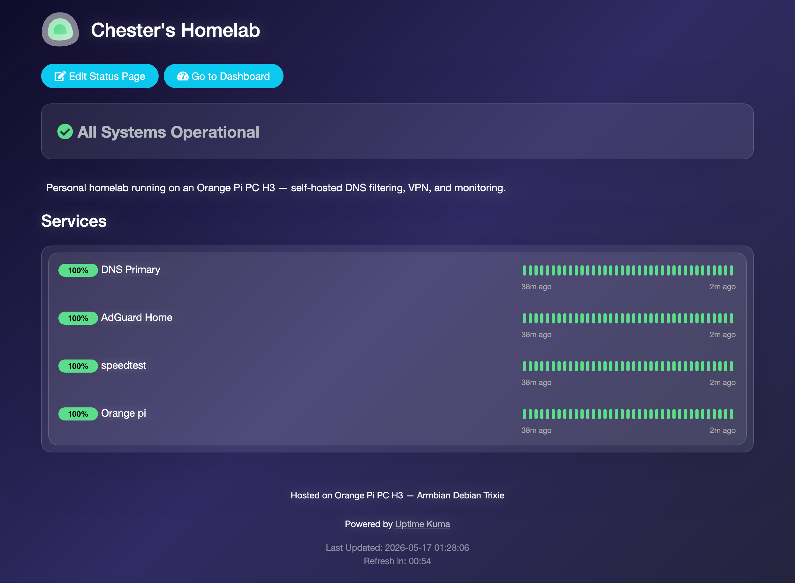

# 🏠 Homelab

Self-hosted services on a single-board computer. Notes on networking,
Linux, and infrastructure as I learn them.

## 🖥️ Hardware

| | |
|---|---|
| Board | Orange Pi PC (Allwinner H3) |
| RAM | 1 GB DDR3 |
| OS | Armbian — Debian Trixie Minimal |
| Storage | MicroSD (SanDisk High Endurance) |

[Initial setup notes →](Orange%20Pi%20setup/README.md)

## 🧰 Stack

| Service | Purpose | Runtime | |
|---|---|---|---|
| Docker | Container runtime | host | [docs](configs/docker/README.md) |
| AdGuard Home | Network-wide DNS filtering — ~83% block rate | container | [docs](configs/adguard/README.md) |
| Tailscale | VPN exit node, extends filtering to mobile | host | [docs](configs/tailscale/README.md) |
| Uptime Kuma | Service + container health | container | [docs](configs/UpTimeKuma/README.md) |
| Fail2ban | SSH brute-force protection | host | [docs](Fail2ban/Fail2ban.MD) |
| Libreoffice | Document Convertion | host | [docs](LibreOffice/LibreOffice.MD) |

⏳ **Next up** — UFW · Nginx reverse proxy · Dell OptiPlex 3070

## 🤔 Why I did it this way

**DNS** — AdGuard resolves upstream over DoH (Cloudflare, Quad9, Google),
so queries leaving the network aren't visible to the ISP.

**Containers where it helps** — AdGuard runs in Docker with config
persisted to `/opt/adguardhome/`, which makes recovery after an SD card
reflash trivial. Tailscale stays on the host; exit-node routing needs
direct access to the host network stack.

**Monitoring, sized to the hardware** — Grafana, Prometheus, and Netdata
are all either too heavy for 1 GB of RAM or solving problems I don't
have. Uptime Kuma answers the actual question: is it up? It watches
AdGuard (HTTP + container), Tailscale, the Pi, DNS, and Speedtest
Tracker via the Docker socket.

**Zero trust on a flat LAN** — Fail2ban bans an IP for an hour after 5
failed SSH attempts in 10 minutes. The network being "private" isn't a
control.

## 🛠️ Build log

**Setup** — Bought an Orange Pi PC listed as an "Orange Pi One." Flashed
the vendor Ubuntu 20.04 image, which was EOL and unstable. Figured out
the actual board model by inspecting it physically.

**First stack** — AdGuard Home and Tailscale installed natively.
Confirmed DNS filtering worked over VPN on mobile.

**OS migration** — Reflashed to Armbian Trixie (correct image for this
board). Backed up AdGuard config over `scp` first, disabled
`systemd-resolved` to free port 53, restored config after.

**Docker migration** — Installed Docker CE from the official Debian
repo, moved AdGuard into a container with persistent volumes. Config,
credentials, and blocklists restored intact.

**Hardening** — Switched upstreams to DoH, verified resolution across
all devices, assessed CVE-2026-31431 exposure.

**Monitoring** — Deployed Uptime Kuma, mounted the Docker socket for
container health checks.

**SSH hardening** — Fail2ban with an SSH jail. Hit a conflict between
Tailscale MagicDNS and system DNS; fixed with `chattr +i` on
`resolv.conf`.

## 💥 Things that broke

| What happened | Fix |
|---|---|
| Board was mislabeled as "Orange Pi One" on Lazada | Identified the real model physically, reflashed correct Armbian image |
| `systemd-resolved` holding port 53 | Disabled it so AdGuard could bind |
| Tailscale MagicDNS overwriting `/etc/resolv.conf` | `chattr +i` to lock the file |
| Vendor Ubuntu 20.04 image unstable + EOL | Migrated to Armbian Debian Trixie |

## 🎯 Goals

Get hands-on with Linux, networking, and self-hosted infra. Document
enough that future-me can rebuild this from scratch.

## 📝 Note

Docs in this repo were structured with LLM assistance. Every step
reflects work actually done on this hardware, including the parts that
broke.